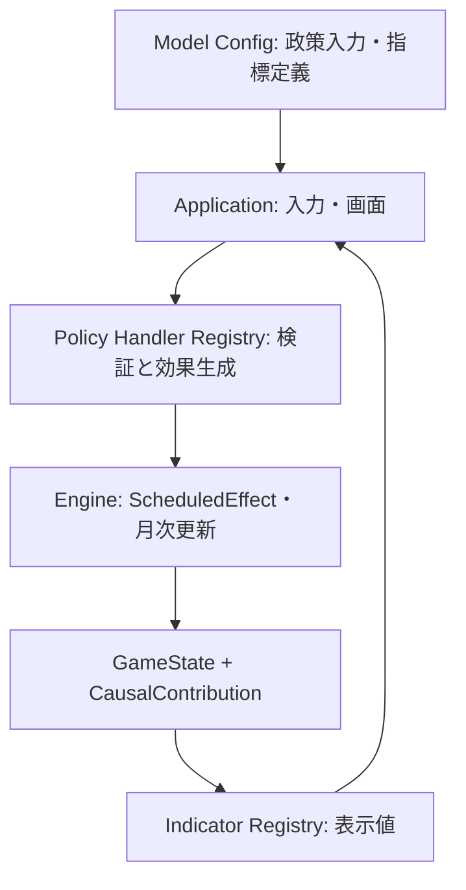

# 政策入力・経済指標の拡張契約

この文書は `docs/04-architecture.md` の ADR-013 を実装するためのリポジトリ内の設計補足。既存の5政策、主要9指標、経済係数、保存済みゲームの挙動は変更しない。

## 境界とデータの流れ

* `packages/model-config` はJSONの形式、重複ID、参照先、入力範囲、係数を検証する。`policyRules` は既存の `inputMin/inputMax` と、新しい `inputs[]` のどちらか一方を使う。新しい入力は `inputId`、表示キー、単位、最小・最大・既定値、任意の刻みを持つ。税率の0.05は5%を表すなど、数値の単位を必ず明示する。`content.indicatorDefinitions` は追加指標のID、表示キー、単位、値の参照方法を宣言する。
* `packages/domain` の `IndicatorRegistry` は登録済みIDだけを読み取る。既存9指標は互換定義を持ち、新しい指標は `content.indicators` と `content.indicatorDefinitions` の両方に登録する。`statePath` は許可された `economy.*` の数値を参照する。算出が必要な場合は純粋な `selectorId` の実装を登録する。欠けた値、非有限値、未登録のセレクタを拒否する。
* `packages/simulation-engine` の `PolicyHandlerRegistry` は政策型ごとの処理を登録する。登録時に設定内の全政策型に対応する処理がなければ失敗する。政策機能を接続する Issue #11 では起動時にこの登録を行う。入力は未知のキー、欠落、範囲外、非有限値、刻み違反を拒否する。同じhandlerを政策プレビューと確定で呼び、効果は既存の `ScheduledEffect` と因果ログを通す。
* UIは設定からフォームと表示項目を組み立て、application層から公開APIを呼ぶ。UIに政策効果や指標の算式を置かない。Handlerの接続、画面生成、保存アダプタの実装は後続の政策・UI Issueで行う。

## 追加時の変更箇所

| 追加対象 | 設定と実装 | 必須検証 |
| --- | --- | --- |
| 既存政策の入力項目 | 対応する `policyRules.json` の新バージョンへ `inputs[]` を設定し、対応handlerを更新する | 範囲・単位・費用・preview/commit一致・旧saveの扱い |
| 新しい政策 | `content.policies`、`policyRules`、シナリオ許可、型別handler、効果・費用とラグを追加する | 未登録handlerの起動失敗、資源不足、因果寄与、単独効果と組合せ、replay |
| 既存の状態から読める指標 | `content.indicators` と `indicatorDefinitions` へ安定ID・単位・`statePath` を追加する | 値が有限か、表示文言、履歴・評価・チャート参照 |
| 新しい計算指標 | 上記に加え純粋selectorを登録する。新しい経済状態が必要なら月次式、State型、範囲検証と保存移行も追加する | 同じ入力・seedで同じ値、寄与合計、旧save migration、長期実行 |
| 経済係数の追加 | `coefficients.json` へ根拠・単位・既定値・許容範囲を記載し、Engine式からIDで参照する | IRF・相関・ラグ・Golden Response。現行係数のチューニングとは別変更 |

新たな入力や指標を設定しただけで経済の挙動は変わらない。新政策にはhandlerが必要で、既存指標以外の経済状態を更新する場合には方程式、CausalContribution、clamp、回帰テストを実装する。データだけで式を実行させる `eval` / `Function` は使用しない。

## 保存・再現性

既存の `content.json` は新しいメタデータを省略できるため、旧packの9指標は同じ場所から読める。既存の単一数値政策は入力ID `value` として扱い、旧 `PolicyDecision` は `inputs` を持たなくても読み込める。新ゲームでは設定ファイルのハッシュを検証し、必要な設定とメタデータを `ConfigSnapshot.normalizedConfig` に保存する。再開時は保存されたsnapshotを使い、配信された新packで上書きしない。

新しい政策や指標を配信する際はContent/Config版とハッシュを更新する。月次式またはEngineの実行順を変える場合はEngine版とGoldenを更新する。保存される状態の必須フィールド・意味を変える場合はSave Schema版とmigration fixtureを同じ変更に含める。旧saveを変換できない場合は旧版のEngineとConfigを保持して再生する。
