# Issue #95 肖像表示の確認画像

360×640の実ブラウザ画面です。政策会議（UI04）と専門家の助言（UI05）で、同じ8人の生成済み肖像を表示しています。

16点の元WebPは素材コミット `5b6e8d50ab3de99afd6196ce6fa5dad0b8cd49d4` のままです。予測値・助言の計算、プロフィール、保存形式は変更していません。

PC、2倍解像度、画像失敗・非表示、200%文字拡大、オフライン、Pagesのサブパスの検証はPlaywrightで実行し、CIの `expert-portrait-review` アーティファクトにも各画面の画像を保存します。

| 専門家 | UI04 選択 | UI05 助言 |
| --- | --- | --- |
| 水城 静香（中央銀行） | 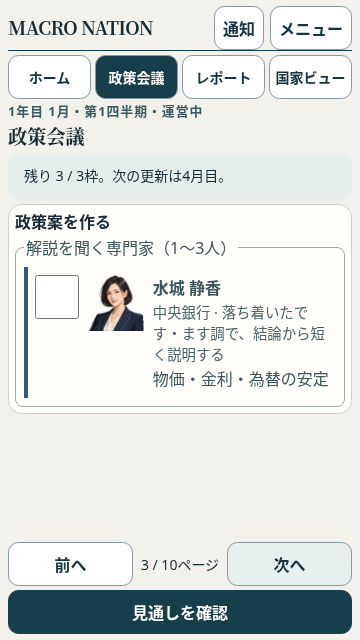 | 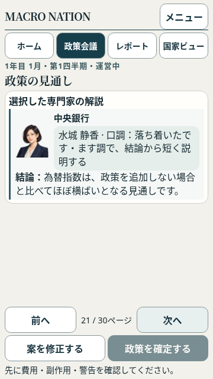 |
| 大蔵 堅（財政） | 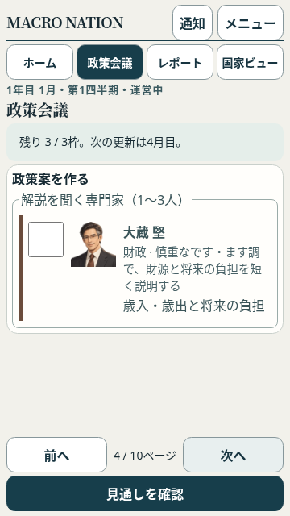 | 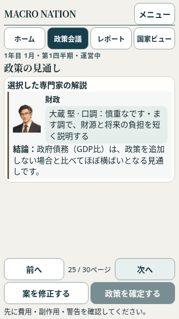 |
| 景山 めぐみ（マクロ経済） | 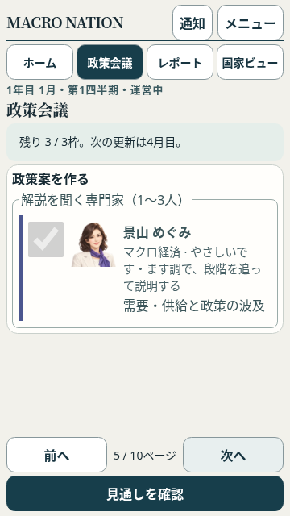 | 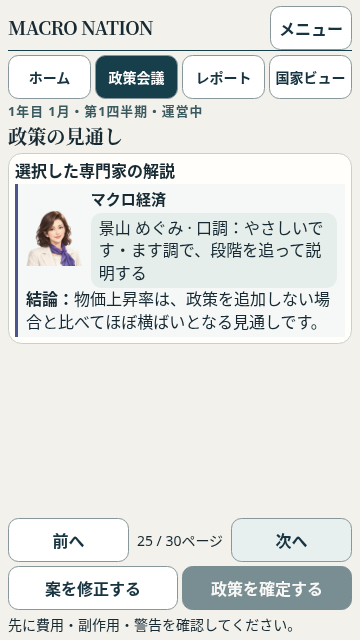 |
| 工藤 拓（産業政策） | 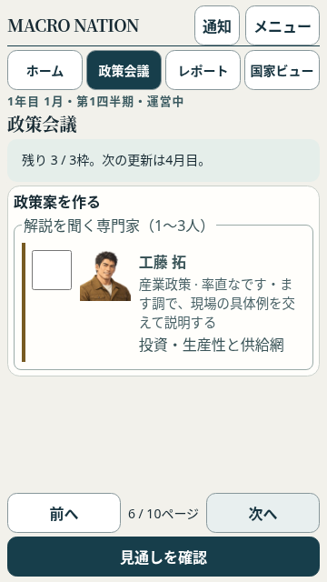 | 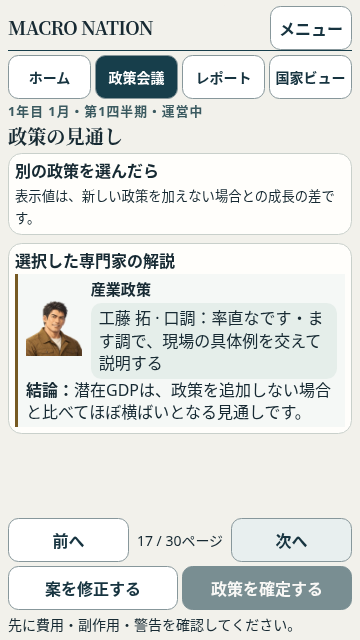 |
| 働木 あゆみ（雇用労働） | 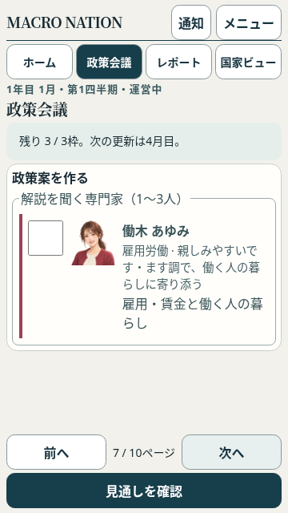 | 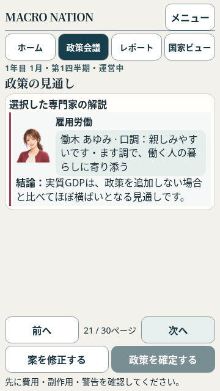 |
| 福原 守（社会政策） | 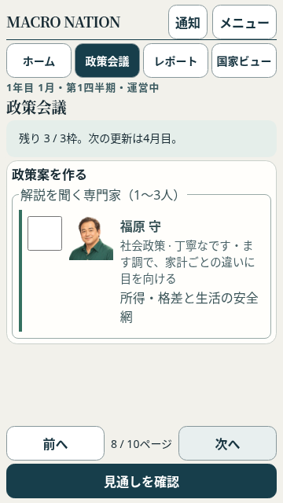 | 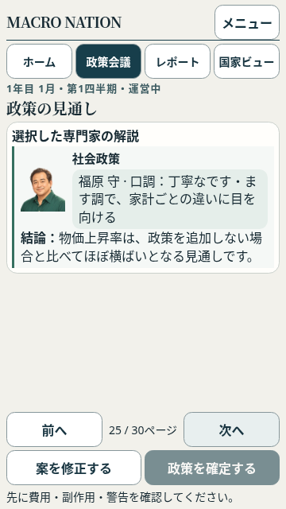 |
| 世代 千歳（人口長期） | 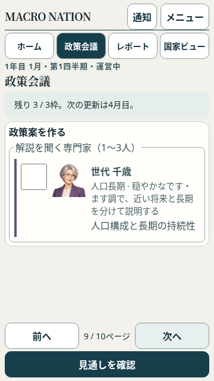 | 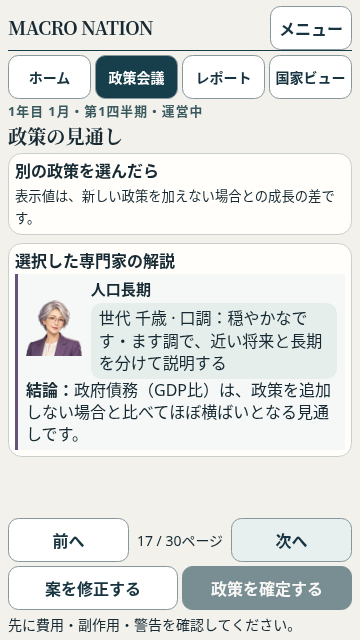 |
| 風間 光（環境エネルギー） | 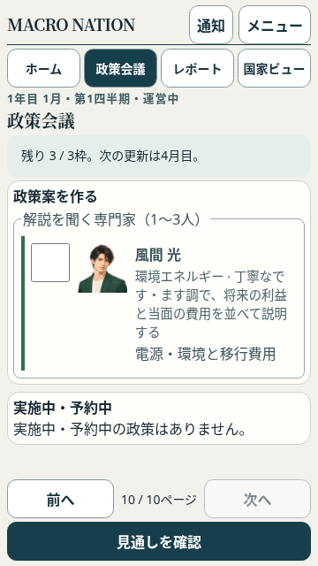 | 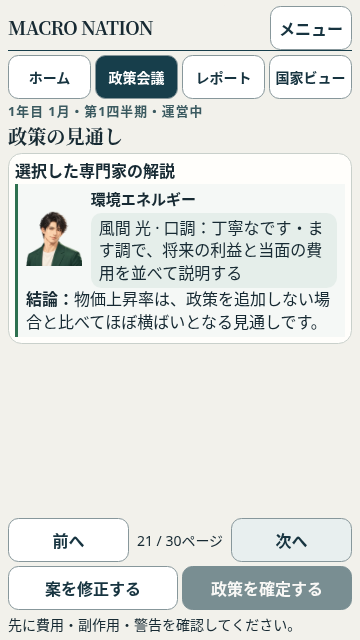 |
