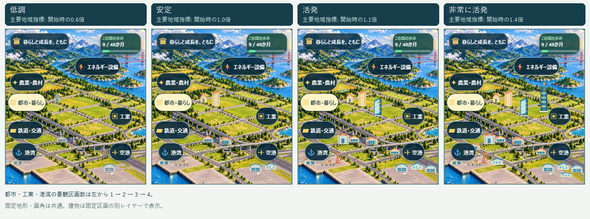
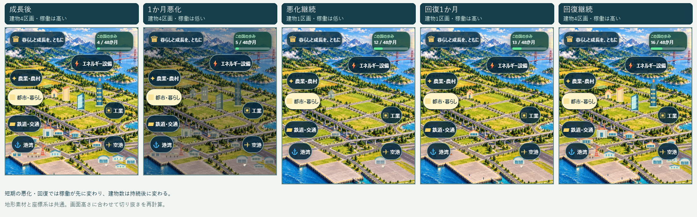

# Issue #93 景観素材と比較結果

`apps/web/public/nation-terrain.webp` は、従来の `nation-coast.webp` を編集元として、建物・可変設備・乗り物を除いた共通地形画像です。実行時の画像生成や外部通信はありません。海岸線、山、島、農地区画、道路、高架経路、港湾岸壁、空港区画は一枚の画像と941×1672の景観座標に固定します。可変施設は `nation-view-rules.json` の固定区画を `NationStructures.tsx` がSVGで描き、#92の動きは同じ座標のCanvasに重ねます。

| 素材 | 寸法 | 容量 | SHA-256 |
| --- | ---: | ---: | --- |
| `nation-terrain.webp` | 941×1672 | 463,936 bytes | `226121A1D586CF930CC858DC85C3DC979699F8582B85BB1C2D3DD0E4052ABC2C` |
| 旧 `nation-coast.webp` | 941×1672 | 538,238 bytes | 削除 |

地形素材は組み込みの imagegen 編集モードで作成し、941×1672の出力をWebP品質84に変換しました。編集指示は次のとおりです。

> Use case: precise-object-edit. Asset type: static terrain base for a layered browser-game nation scene. Image 1 is the edit target. Preserve its exact portrait framing, composition, perspective, lighting, painterly style, mountain silhouettes, coastline, islands, river and bay boundaries, hills, fields, forests, bridge alignment, roadway geometry, railway alignment, port quay boundary, airport runway footprint, and empty land plot locations. Remove all changeable buildings and facilities: city buildings, houses, offices, skyscrapers, factories, chimneys, warehouses, barns, silos, cranes, containers, terminals, control tower, aircraft, ships, trains, cars, trucks, wind turbines, solar panels and equipment. Paint vacant terrain, grassy or paved fixed parcels in their place, keep roads and rails visible, and add no new buildings, vehicles, text, labels, ghost silhouettes or traces. Keep the same clear sunny light, saturated painterly palette, and high detail.

## 代表4段階

`tests/e2e/nation-landscape.spec.ts` が、同じ360×800ビューポートと同じ月で実質GDP・製造業生産・輸出などの主指標を開始時の0.6倍、1.0倍、1.1倍、1.4倍にした合成fixtureを保存し、再読込後に撮影します。都市・工業・港湾の可視区画数はそれぞれ1、2、3、4です。同じ施設IDの座標を各段階で照合します。fixtureは画面検証用で、経済モデルの実測推移を意味しません。

## 悪化と回復

1か月の悪化や回復では建物数を保ち、稼働状態だけを先に変えます。悪化が続くと規模が縮小し、回復が続くと元の区画ID・位置へ増築します。月数に伴い画面の残り高さが変わる場合も、地形・施設・動きは同じ座標から共通のcover切り抜きで表示します。

比較画像はPlaywright Chromiumで作成しました。自動テストは画角・施設数・種類・ID・座標、動き軽減、低品質、オフライン再読込を確認します。画像容量とフレームレートの計測値はPR本文に記録します。モバイル実機での性能確認は別途必要です。
